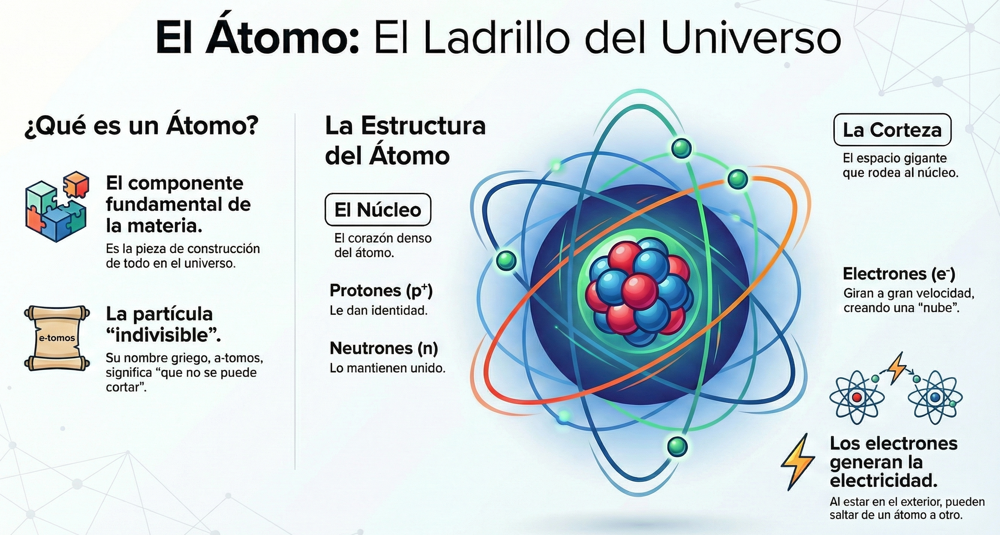
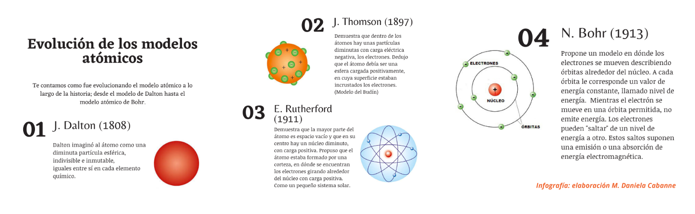
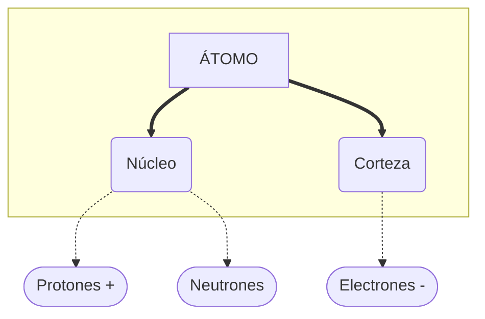
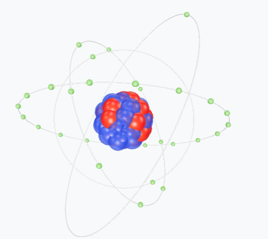
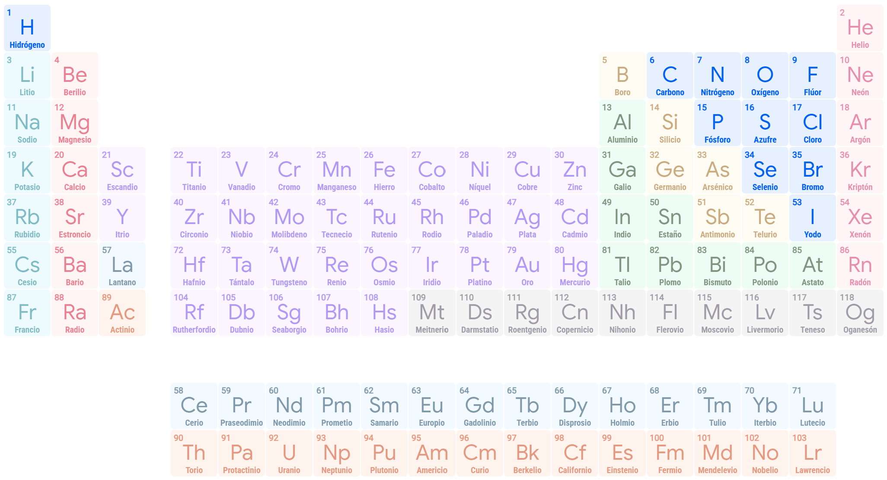

# El átomo

## Definición de átomo

{ align=right width=45% }

Imagina que tienes una hoja de papel y la cortas por la mitad, y luego otra vez, y otra vez... llegaría un momento en que tendrías un trocito tan pequeño que ya no podrías cortarlo más. Ese "trocito" final es el ==**átomo**==.

El átomo es la pieza de construcción de todo el universo: desde tu móvil hasta el aire que respiras o las estrellas.

Los fenómenos eléctricos tiene su origen en la **estructura interna de la materia**, que está formada por partículas diminutas llamadas **átomos**, como hemos visto :simple-electron:. 

!!! note "Definición de Átomo"
    El **átomo** es el componente fundamental de la materia, y proporciona sus propiedades.

## Estructura del átomo

La palabra **átomo** viene del griego *a-tomos*, que significa **"indivisible"**. Antiguamente se pensaba que eran las piezas más pequeñas posibles y que no se podían romper.

Aunque el átomo es la unidad básica de la materia, es como un pequeño rompecabezas formado por **dos zonas** (núcleo y corteza) y **tres prtículas subatómicas** principales (protones, neutrones y electrones).

### ¿Cómo se organizan estas partes?

{ align=right width=30% }

==**NÚCLEO:**==  Es el "corazón" del átomo, la **zona más interna**. Es increíblemente **denso**, por lo general, el 99% del peso total de un átomo se encuentra concentrado en el núcleo. 

Aquí se encuentran dos tipos de partículas subatómicas: 

  - **Protones ($p^+$):**  Dan identidad al átomo (como su DNI).

  - **Neutrones ($n$):**  Actúan como "pegamento" para que los protones no se separen.  

==**CORTEZA:**==  Es el espacio gigante que rodea al núcleo.  

  Aquí se encuentra un tipo de partícula subatómica:

  - **Electrones ($e^-$):**  Giran a una velocidad increíble, creando una especie de "nube". Son los que pueden saltar de un átomo a otro, creando la **corriente eléctrica**.

Vamos a estudiar con atención las partículas subatómicas constituyentes del átomo y la facultad de moverse que tienen los electrones.

## Número atómico (Z)

Ahora vamos a descubrir qué es eso del **número atómico**. Cada átomo tiene una identidad secreta, como un DNI. Pues bien, ese "DNI" es precisamente el **número atómico**.

{ align=right width=20% }

!!! note "Definición de Número Atómico (Z)"
    El **número atómico** (que los científicos escriben con la letra **Z**) es el ==número de **PROTONES**== que hay dentro del núcleo.

*   **Es la identidad del átomo:** Lo que hace que un átomo sea de **cobre** es simplemente el número de protones (Z = **29**) que tiene en su núcleo, y no de **platino** que tiene **78**.
  
    *   **Importante:** Si un átomo tiene 29 protones, siempre será Cobre. No puede ganar ni perder protones.

Tabla periódica de los elementos
 [Haz clic aquí para ampliar](https://artsexperiments.withgoogle.com/periodic-table/?exp=true&lang=es)
