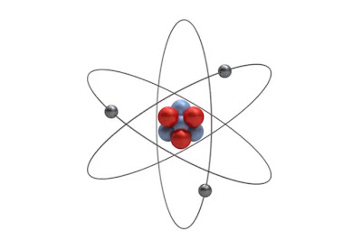

# 📒 Ficha 1: Estructura del átomo

!!!question "Ejercicio 1"
    Completa las siguientes frases con las siguientes palabras: 

    

    **átomos – electrones – neutrones – subpartículas - protones**
    

    
    > "La materia está formada por partículas muy pequeñas llamadas ................... . Los átomos están formadas por tres tipos de .................... Los ..................., ................... y ................... son las tres partículas que forman los átomos."

!!!question "Ejercicio 2"
    Contesta las siguientes preguntas:

    {align=right width=30%}

    1.  ¿Cuáles son las dos **zonas** principales del átomo. Indícalas también en el dibujo.  
    2.  Nombra las tres **partículas subatómicas** que lo forman y en qué zona se encuentran.  
    3. ¿Qué partícula **gira en la corteza** alrededor del núcleo? 
    4.  ¿Qué partícula subatómica es la máxima responsable de la **electricidad**?  
   

!!!question  "Ejercicio 3"
    Completa las frases siguientes: 

    * Los **protones** son conocidos como cargas eléctricas ................... .  
  
    * Los **electrones** son conocidos como cargas eléctricas ................... . 
  
    * Los **neutrones** son conocidos como cargas eléctricas ................... .

!!!question "Ejercicio 4"
    Busca en la tabla periódica el **Aluminio**. 

    * ¿Cuál es su número atómico?...................Por lo tanto, tiene ................... en su .................... .
    
    1.  Si lo consideramos neutro tendría ................... en su ................... .  
   
    2.  Dibuja el átomo neutro de aluminio.  

!!!question "Ejercicio 5"
    Dibuja la estructura de un:

    | **átomo neutro de carbono** | **ión negativo** de **carbono**    (átomo cargado negativamente)|**ión positivo** de **carbono**    (átomo cargado positivamente) |
      | :---: | :---: | :---: | 
    |     |     |    |

!!!question "Ejercicio 6"
    Dibuja un átomo neutro, uno cargado positivamente y otro negativamente. Todos tienen 4 protones en el núcleo.

    ¿A qué átomo corresponde?

!!!question "Ejercicio 7"
    Contesta las siguientes preguntas:

    1.  Si un **átomo neutro** tiene 8 protones (carga positiva), ¿cuántos electrones tendrá?  
    2.  ¿Qué tiene que ocurrir para convertirse en **ión negativo**?  
    3.  ¿Qué tiene que ocurrir para convertirse en **ión positivo**? (Partimos de un átomo neutro)  
  
!!!question "Ejercicio 8"
    1.  Si acercamos una carga positiva (protón) a una carga negativa (electrón) se ……………………………… .
    2.  Si acercamos dos electrones se ……………………………………… .
    3. Si acercamos dos protones se ……………………………………… .

!!!question "Ejercicio 9"
    ¿Qué tipo de partículas subatómicas se muestran en los dibujos?   Explica el motivo de tu respuesta en los dos casos.

    |   1  |   2  |
    | :---: | :---: |
    |   |   |
   

!!!question "Ejercicio 10"

    1.  Para que un átomo neutro (mismos electrones y protones) se quede cargado negativamente qué tiene que ocurrir.

    2.  Para que un átomo neutro (mismos electrones y protones) se quede cargado positivamente qué tiene que ocurrir.
 
